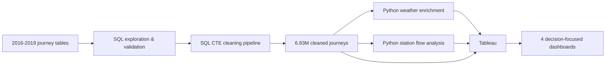

# Bluebikes End-to-End Data Analysis

An end-to-end analysis of **6.8M+ Bluebikes journeys across Greater Boston from 2016 to 2019**, combining **SQL, Python and Tableau** to examine demand growth, user behaviour, station operations and weather-related demand patterns.

The project was built around four business questions:

1. How did demand change between 2016 and 2019?
2. When and how do different user groups travel?
3. Where is operational intervention most needed?
4. How are weather conditions associated with daily demand?

## Project at a glance

| Metric | Result |
|---|---:|
| Cleaned journeys | **6,834,930** |
| Weather-matched journeys | **6,703,545** |
| Growth, 2016 to 2019 | **+104.1%** |
| 2019 journeys | **~2.52M** |
| Subscriber share | **80.6%** |
| Invalid / >24h journeys removed | **5,390** |
| Duplicate journey keys after cleaning | **0** |

## Technical workflow



### SQL

SQL was used to combine four annual journey tables and create one reusable analytical layer.

The final pipeline uses:

- Common Table Expressions (CTEs)
- `UNION ALL`
- `LEFT JOIN`
- targeted subqueries and validation queries
- `CASE`, `CAST`, `NULLIF` and `REPLACE`
- date/time extraction and journey-duration calculations
- null, duplicate and exception checks
- explicit column selection rather than `SELECT *` in the final output

The staged CTE structure separates:

```text
combined_bluebikes_data
        ↓
station_enriched_data
        ↓
cleaned_bluebikes_data
        ↓
final_bluebikes_data
```

See the [SQL folder](sql/) for the original project scripts.

### Python

Python/pandas was used for two enrichment tasks:

**Weather enrichment**
- converted and aligned dates
- mapped NOAA weather stations to districts
- aggregated journey starts to **Date + District** grain
- merged rainfall, snowfall and temperature measures
- validated row counts, duplicates and unmatched values

**Station flow analysis**
- aggregated starts and ends by station
- merged both measures into one station-level table
- created the input used for directional flow analysis

See the [Python folder](python/) for the original notebooks.

### Tableau

The Tableau analysis was structured into four dashboards:

- **Executive Overview**
- **Demand & User Behaviour**
- **Stations & Operations**
- **Weather & Demand**

Calculated fields include journey growth, Subscriber share, starts per dock, net-flow measures, weekday/weekend segmentation and weather categories.

See [Tableau calculations](tableau/calculated-fields.md) and [workbook structure](tableau/workbook-structure.md).

## Data quality and validation

Validation was performed throughout the workflow rather than only at the end.

Key checks included:

- reconciling annual source counts after `UNION ALL`
- validating ride year against timestamps
- checking journey duration exceptions
- excluding **10** journeys where end time was not later than start time
- excluding **5,380** journeys longer than 24 hours
- confirming **0 duplicate journey keys** in the final data
- standardising birth-year formats and retaining invalid values as missing rather than inventing replacements
- retaining valid journeys even when historic station IDs could not be mapped

The final cleaned journey dataset contains **6,834,930 records**.

For the weather analysis, **6,703,545 journeys** could be represented at district level. The difference is primarily caused by historic station IDs that were not present in the supplied station lookup.

See [Data Quality & Validation](documentation/data-quality-validation.md).

## Key findings

### 1. Demand more than doubled

Annual journeys increased from approximately **1.24M in 2016** to **2.52M in 2019**, an increase of **104.1%**.

Demand also follows a strong seasonal pattern, with winter troughs and warmer-month peaks.

### 2. Subscribers and Customers behave differently

Subscribers account for **80.6%** of journeys and show clear peaks around **08:00 and 17:00**.

Median journey duration:
- **Subscribers:** ~10.1 minutes
- **Customers:** ~21.2 minutes

Customer activity is relatively stronger at weekends, while Subscriber activity is more concentrated around weekday peaks.

These patterns are described as **commuter-style** and **leisure-style**, not confirmed trip purposes.

### 3. Operational pressure is concentrated

High-demand origins cluster around transport, university and employment hubs.

Stations including **South Station, Central Square and MIT Stata Center** appear among the highest-demand locations.

Starts per dock was used as a relative demand-to-capacity indicator to identify stations that may warrant closer capacity review.

### 4. Directional flow identifies rebalancing pressure

Net flow was calculated as:

```text
Total journey ends - Total journey starts
```

Examples:
- **Nashua Street at Red Auerbach Way:** ~**+28,646** net flow, indicating accumulation pressure
- **359 Broadway:** ~**-8,601** net flow, indicating depletion pressure

This creates a practical basis for targeted redistribution rather than blanket system-wide rebalancing.

### 5. Weather is associated with meaningful demand differences

Average daily journeys decline as rainfall becomes heavier:

| Weather | Avg daily journeys |
|---|---:|
| Dry | ~1,303 |
| Light rain | ~1,251 |
| Moderate rain | ~1,158 |
| Heavy rain | ~811 |

Recorded snowfall days averaged approximately **532 journeys**, compared with **1,579** on days without recorded snowfall.

Warmer temperatures are also associated with higher demand, although this overlaps strongly with seasonality and is **not treated as a causal relationship**.

## Recommendations

1. **Rebalance before peak periods**  
   Use station net-flow patterns to redistribute bikes before the strongest 08:00 and 17:00 Subscriber peaks.

2. **Review constrained stations**  
   Prioritise stations where high total starts, high starts per dock and persistent directional imbalance overlap.

3. **Plan around weather and seasonality**  
   Use forecasts alongside historic demand patterns to flex redistribution, staffing and maintenance.

The priority is targeted intervention at the **right station, at the right time, under the right conditions**, rather than treating system growth as one uniform operational problem.

See [Insights & Recommendations](documentation/insights-and-recommendations.md).

## Repository structure

```text
.
├── README.md
├── sql/
│   ├── 01_data_exploration.sql
│   ├── 02_data_cleaning_validation.sql
│   └── 03_final_dataset.sql
├── python/
│   ├── weather_enrichment.ipynb
│   └── station_flow_analysis.ipynb
├── tableau/
│   ├── calculated-fields.md
│   └── workbook-structure.md
├── documentation/
│   ├── technical-workflow.md
│   ├── data-quality-validation.md
│   ├── insights-and-recommendations.md
│   └── limitations.md
├── data/
│   └── README.md
├── requirements.txt
└── .gitignore
```

## Data availability

The raw journey extracts and Tableau packaged workbook are not stored in this repository because they are large training/project data files. The repository focuses on the **analysis logic, validation approach, Python enrichment, Tableau design and business conclusions**.

The SQL and Python code show how the analytical outputs were produced.

## Assumptions and limitations

The main limitations are documented rather than hidden:

- the historic station lookup does not map every station ID
- starts per dock is a relative pressure indicator, not live occupancy
- weather is represented at district-day level
- snowfall coverage is less complete than rainfall and temperature
- weather findings show association, not causation
- trip purpose is not recorded
- invalid/missing birth years were not imputed
- gender codes were not defined clearly enough to support confident interpretation

See [Limitations](documentation/limitations.md).

## What this project demonstrates

This project demonstrates an end-to-end analytical workflow: **data exploration, SQL cleaning and validation, multi-source enrichment in Python, dashboard development in Tableau, analytical judgement, documented limitations and stakeholder-focused recommendations.**

---

**Tarandeep Rehlon**  
Data Analyst / Trainee Data Consultant portfolio project
